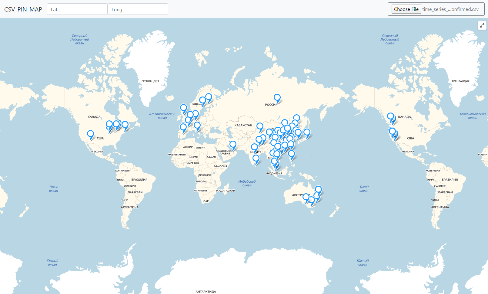

# CSV-PIN-MAP

I made this tool for analyzing geodata while studying React🚀

## How it works:

- download any geodata dataset in .csv format (e.g example_data.csv)
- open https://csv-pin-map.netlify.com/
- specify the latitude/longitude columns names
- click **[Choose File]** to load the data and visualise on the map as a pins📌

### Hosted on: https://csv-pin-map.netlify.com
